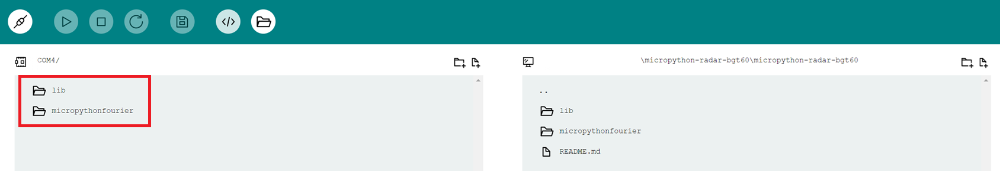

# Micropython-Radar BGT60TRXX
With this Library a BGT60TRxx-Sensor can be configured
and used for the PSOC6-Microcontoller (CY8CKIT-062S2-AI) of Infineon.  

> [!NOTE]  
> This project is work in progress and not covering all functions
of the sensor yet.   
> If you are missing an entity type feel free to [contribute](https://github.com/Infineon/micropython-radar-bgt60/fork) or [open an issue](https://github.com/Infineon/micropython-radar-bgt60/issues).

## Overview
The BGT60TRXX-Sensor is a 60GHz sensor of [infineon](https://www.infineon.com/cms/en/product/sensor/radar-sensors/radar-sensors-for-iot/60ghz-radar/)
which is used for advanced sensing.

The Sensor can be used up to 15m and because of its low power consumption
is ideal for many IOT-Use-Cases.

Use-Cases:
 - Presence-Detection/Segmentation
 - Touchless Interaction
 - Vital Sensing

## Dependencies
This module needs an FFT-Algorithm from [Peter Hinch and Oleksandr Teteria](https://github.com/peterhinch/micropython-fourier) to work properly.  

As for the PSOC6 some things in the library had to be altered a working version
has been included inside ```/micropython-radar_bgt60/micropythonfourier```

## Usage in MicroPython
When using the [Arduino Lab for MicroPython](https://labs.arduino.cc/en/labs/micropython) the libraries from ```/micropython-radar_bgt60``` needs to
be uploaded to the chip.



There are two ways to upload the main-program:
1) Upload the main.py file like the libraries
    > [!INFO]  
    > When Booting the controller the program starts automatically
    
    > [!WARNING]  
    > When the program ends in an endless loop no new programs can be uploaded
    > and the system needs to be reflashed (see [Reflashing](./README.md#Reflashing))
2) Upload it temporay using the Run-Command inside the Arduino-Lab
    > [!WARNING]  
    > When reseting, the controller can be reprogrammed.  
    > But the first method needs to be used, when the program needs to
    > run independently

## Things to consider when using this Library
- As Micropython is much slower than standard C-Code, the speed is a lot worser in Micropython
    - measured time for a 128-Bit Chirp (Fetch, FFT, High-Pass-Filter and logaritmic scaling):  
        59.93ms or 16.68Hz  
- The readFIFO-Function can only transmit 8192 words,
which consists of 24 Data-Bits
    - Max Transmission possible: 24.576 Bytes
- The Chip returns an Error when Reading while the Stack is full or empty!
- Data can be checked via a CheckData-Function for Overflow/Underflow

## Default Usage
```python
# import Module
import lib.BGT60TRXX as BGT

# Create Instance
# An optonal parameter can be used to configure
# the Interrupt-Request to a user-defined function
radar_sensor = BGT.BGT60TRxxModule(<wordsize>, <optional function>)

# Configure Register Values with pre-defined functions
radar_sensor.setCompareValue(50) # in '%'
#...

# Configures all Registers for Usage
# They need to be configured before hand
radar_sensor.initSensor()

data = radar_sensor.read_reg(<ADDR_REG>)
radar_sensor.write_reg(<ADDR_REG>, <DATA>)

# reset fifo state
radar_sensor.resetFIFO()

# start frame generation before a fifo read
radar_sensor.startFrame()

# Reads from the Sensor.
# data is stored inside radar_sensor.data
radar_sensor.readFifo()

# Read and calculate Distance-Profile
radar_sensor.readDistance()
```

## Flashing of CY8CKIT-062S2-AI 
1) install [this script](https://raw.githubusercontent.com/infineon/micropython/ports-psoc6-main/tools/psoc6/mpy-psoc6.py)
2) run following command in terminal  
```python mpy-psoc6.py device-setup -b CY8CKIT-062S2-AI```

## Reflashing
When the microcontroller is stuck in an endless loop,
a reflashing is needed.  
Only then a new program can be uploaded.

1) erase flash  
```python mpy-psoc6.py device-erase -b CY8CKIT-062S2-AI```
2) upload bootloader anew  
```python mpy-psoc6.py device-setup -b CY8CKIT-062S2-AI```