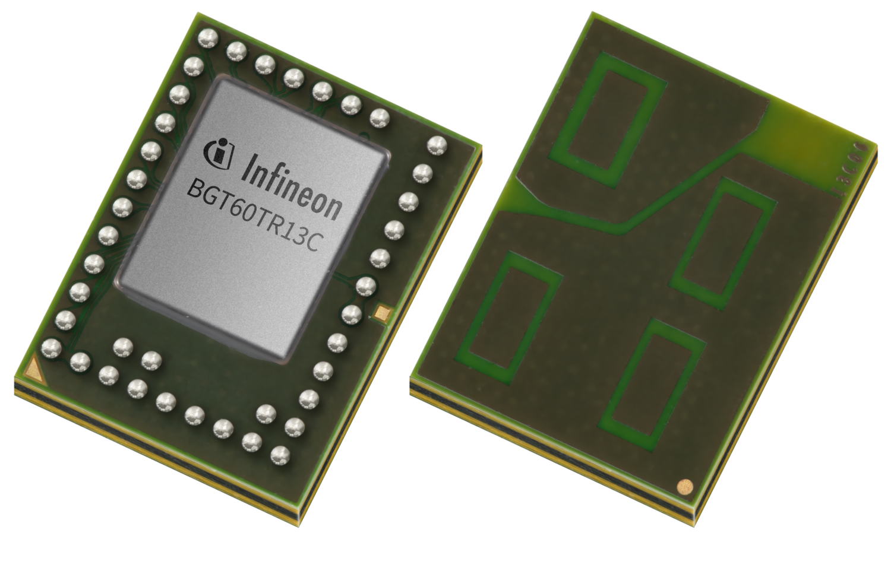
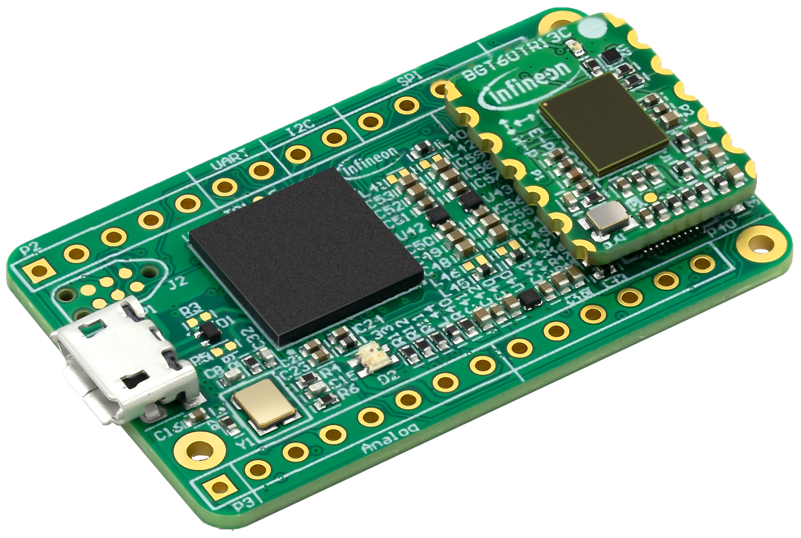
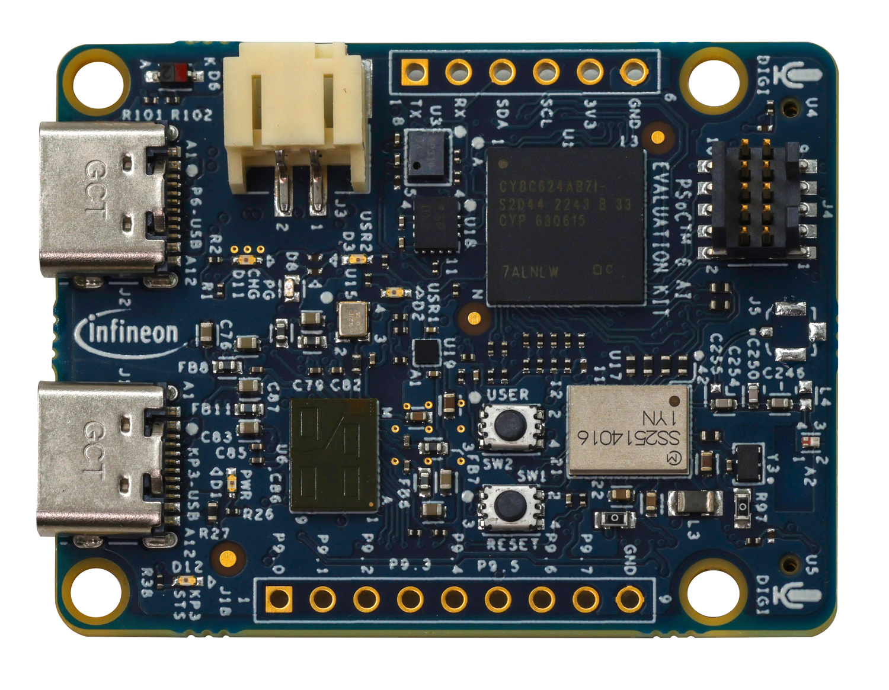
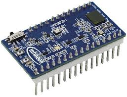

# MicroPython Driver for 60 GHz Radar Sensors


With this library Infineon's XENSIV™ BGT60TR13C 60 GHz radar sensor can be configured
and used with [MicroPython](https://github.com/Infineon/micropython) via SPI.

Please refer to the product pages linked below for more information about the sensor and supported evaluation boards.

> [!NOTE]
> This project is work in progress and not covering all functions of the sensor yet.   
> If you are missing any functionality feel free to [contribute](https://github.com/Infineon/micropython-radar-bgt60/fork) or [open an issue](https://github.com/Infineon/micropython-radar-bgt60/issues).

### Supported Products

<table>
    <tr>
        <td></td>
        <td></td>
        <td></td>
        <td></td>
    </tr>
    <tr>
        <td style="test-align : center"><a href="https://www.infineon.com/part/BGT60TR13C">XENSIV™ BGT60TR13C</a></td>
        <td style="test-align : center"><a href="https://www.infineon.com/evaluation-board/DEMO-BGT60TR13C">Demo kit with XENSIV™ BGT60TR13C 60 GHz radar sensor</a></td>
        <td style="test-align : center"><a href="https://www.infineon.com/evaluation-board/CY8CKIT-062S2-AI">PSOC™ 6 Artificial Intelligence Evaluation Kit</a></td>
        <td style="test-align : center"><a href="https://www.infineon.com/evaluation-board/KIT-CSK-BGT60TR13C">XENSIV™ connected sensor kit with XENSIV™ BGT60TR13C 60 GHz radar sensor</a></td>
    </tr>
</table>

## Getting Started

### MicroPython Firmware Installation
Before using this module, ensure that the MicroPython firmware is installed on your microcontroller.
If you are using a PSOC™ 6 board, you can find the installation instructions [here](https://ifx-micropython.readthedocs.io/en/latest/psoc6/intro.html#install-micropython-on-the-board).
If you have a different MicroPython-compatible board, please refer to the [official MicroPython documentation](https://docs.micropython.org/en/latest/).

### Dependencies
This module depends on the [micropython-fourier module](https://github.com/peterhinch/micropython-fourier),
written by Peter Hinch.

A modified version compatible with PSOC™ 6 is available in [this fork](https://github.com/ederjc/micropython-fourier).

The dependencies are automatically installed when installing the module using the method described below.

### Installation of this Module

#### Using mip (recommended)

> [!NOTE]
> This method assumes that your MicroPython device is connected to the internet.
> If this is not the case, please refer to the manual installation instructions below.

You can install this module using [mip](https://docs.micropython.org/en/latest/reference/packages.html#installing-packages-with-mip),
MicroPython's built-in package manager:
```
import mip
mip.install('github:infineon/micropython-radar-bgt60')
```

#### Manual Installation
- Download these files from the micropython-fourier repository:
    - [dft.py](https://raw.githubusercontent.com/ederjc/micropython-fourier/refs/heads/master/dft.py)
    - [dftclass.py](https://raw.githubusercontent.com/ederjc/micropython-fourier/refs/heads/master/dftclass.py)
    - [window.py](https://raw.githubusercontent.com/ederjc/micropython-fourier/refs/heads/master/window.py)
    - [polar.py](https://raw.githubusercontent.com/ederjc/micropython-fourier/refs/heads/master/polar.py)
- Download these files from this repository:
    - [BGT60TRXX.py](https://raw.githubusercontent.com/Infineon/micropython-radar-bgt60/refs/heads/main/micropython-radar-bgt60/BGT60TRXX.py)
    - [BGT60TRXX_define.py](https://raw.githubusercontent.com/Infineon/micropython-radar-bgt60/refs/heads/main/micropython-radar-bgt60/BGT60TRXX_define.py)

And drag-and-drop them onto your MicroPython device using e.g. [Thonny IDE](https://thonny.org/) or any other suitable tool.

### Usage

### Things to consider when using this Library
- MicroPython executes code significantly slower than standard C, resulting in reduced performance when using this library:
    - measured time for a 128-bit chirp (fetch, FFT, high-pass filter, and logarithmic scaling):
        59.93 ms or 16.68 Hz  
- The `readFifo` function can only transmit 8192 words,
which consist of 24 data bits
    - Maximum transmission possible: 24.576 bytes
- The chip returns an error when reading while the stack is full or empty
- Data can be checked for overflow or underflow errors using the `checkData` function

### Example Code
```python
# import Module
import BGT60TRXX as BGT

# Create Instance
# An optonal parameter can be used to configure
# the Interrupt-Request to a user-defined function
radar_sensor = BGT.BGT60TRxxModule(<wordsize>, <optional function>)

# Configure Register Values with pre-defined functions
radar_sensor.setCompareValue(50) # in '%'
#...

# Configures all Registers for Usage
# They need to be configured before hand
radar_sensor.initSensor()

data = radar_sensor.read_reg(<ADDR_REG>)
radar_sensor.write_reg(<ADDR_REG>, <DATA>)

# reset fifo state
radar_sensor.resetFIFO()

# start frame generation before a fifo read
radar_sensor.startFrame()

# Reads from the Sensor.
# data is stored inside radar_sensor.data
radar_sensor.readFifo()

# Read and calculate Distance-Profile
# data is stored inside radar_sensor.data
radar_sensor.readDistance()
```