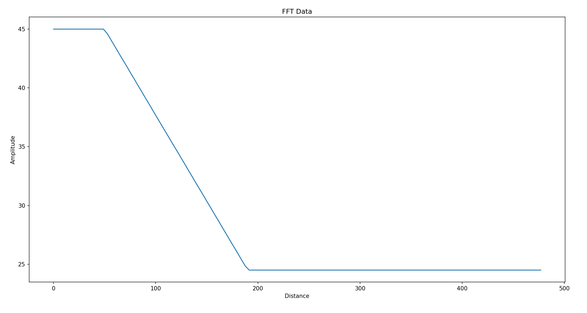

# Micropython-Radar BGT60TR13C Example Program
This example program reads data from the BGT60TR13C radar sensor on the CY8CKIT-062S2-AI Kit from Infineon and prints the distance of the nearest object to the terminal.

## Threshold Function
The threshold function is defined using the find_nearest_peak function.  
This function utilizes two predefined values: threshold_for_upper_freq and threshold_for_lower_freq. 

Between the defined start and end indices, a linear function is generated to determine the threshold. For a visual representation, please refer to the image below.


## Usage
1) Upload the ```main.py``` to the microcontroller
2) Open a Terminal
3) The terminal output will be in the format: 
    >Peak detected at: \<x> cm