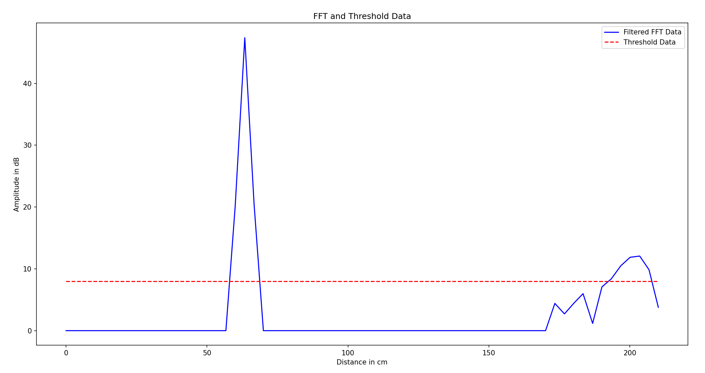

# Micropython-Radar BGT60TR13C Example Program
This example reads the BGT60TR13C radar sensor of the CY8CKIT-062S2-AI Kit from
Infineon and prints the distance-profile over UART.

The server-program (runs on PC) uses this and plots the results.

## Usage
1) Upload the ```main.py``` to the microcontroller
2) Close Connection to Arduino-Lab, so new connection can be opened
3) Install requirements on your host using the terminal command  
```pip install -r requirements.txt```
4) Start Server-Side program using the terminal command   
```python server_cont_receive.py```
 > [!WARNING]
 > The Serial Port inside of the program needs to be changed to
 > the port you're using.

 

 Terminal output consisting of:
 1) Time needed for function
 2) Transmitted data: Format of single packet = \<distance in cm>,\<value>;
 3) Peaks detected at x cm.  
 > >Function readFIFO Time = 63.212ms  
0.0,0.00;7.5,39.44;15.0,42.99;22.5,42.12;30.0,40.42;37.6,39.13;45.1,37.41;52.6,37.63;60.1,35.39;67.6,34.64;75.1,33.15;82.6,31.68;90.1,30.32;97.6,28.71;105.1,27.25;112.7,26.28;120.2,25.35;127.7,25.43;135.2,25.58;142.7,26.03;150.2,26.46;157.7,26.81;165.2,27.23;172.7,27.80;180.3,27.66;187.8,29.27;195.3,32.70;202.8,17.70;210.3,28.41;217.8,13.19;225.3,24.29;232.8,20.34;240.3,22.95;247.9,18.73;255.4,19.77;262.9,18.59;270.4,17.79;277.9,19.69;285.4,18.53;292.9,19.38;300.4,20.86;307.9,19.47;315.4,20.26;323.0,18.78;330.5,19.25;338.0,19.72;345.5,17.82;353.0,18.61;360.5,19.00;368.0,18.71;375.5,17.65;383.0,19.56;390.6,21.28;398.1,15.81;405.6,16.22;413.1,16.12;420.6,18.74;428.1,17.34;435.6,18.90;443.1,18.17;450.6,15.60;458.1,17.29;465.7,16.26;473.2,17.38;  
>Peaks detected:  
>195.3