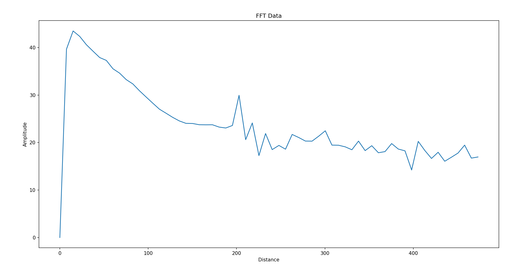

# Micropython-Radar BGT60TR13C Example Program
This example reads the BGT60TR13C radar sensor of the CY8CKIT-062S2-AI Kit from
Infineon and prints the distance-profile over UART.

The server-program (runs on PC) uses this and plots the results.

## Usage
1) Upload the ```main.py``` to the microcontroller
2) Close Connection to Arduino-Lab, so new connection can be opened
3) Install requirements on your host using the terminal command  
```pip install -r requirements.txt```
4) Start Server-Side program using the terminal command   
```python server_cont_receive.py```
 > [!WARNING]
 > The Serial Port inside of the program needs to be changed to
 > the port you're using.

 

 Terminal output consisting of:
 1) Time needed for function
 2) String fft to show, that fft data will be transfered next
 3) Transmitted data: Format of single packet = \<distance in cm>,\<value>;
 4) For the threshold function: the string "threshold" will be send before.
 > \>Function readFIFO Time = 62.426ms
fft;0.0,0.00;7.5,39.31;15.0,43.10;22.5,41.52;30.0,40.21;37.6,38.66;45.1,37.28;52.6,36.31;60.1,36.07;67.6,34.37;75.1,33.40;82.6,31.99;90.1,30.67;97.6,29.44;105.1,28.36;112.7,27.24;120.2,26.11;127.7,25.07;135.2,24.74;142.7,23.72;150.2,23.54;157.7,23.51;165.2,23.28;172.7,23.43;180.3,23.11;187.8,23.15;195.3,22.72;202.8,24.13;210.3,22.12;217.8,20.71;225.3,21.66;232.8,17.55;240.3,23.59;247.9,22.91;255.4,19.39;262.9,22.79;270.4,20.17;277.9,19.38;285.4,17.91;292.9,19.53;300.4,18.55;307.9,20.03;315.4,19.86;323.0,18.94;330.5,18.34;338.0,18.01;345.5,17.88;353.0,19.38;360.5,19.26;368.0,17.54;375.5,17.13;383.0,17.25;390.6,16.89;398.1,18.98;405.6,17.80;413.1,17.85;420.6,16.95;428.1,18.24;435.6,17.31;443.1,17.49;450.6,17.49;458.1,17.63;465.7,17.44;473.2,17.40;
threshold;0.0,45.00;7.5,45.00;15.0,45.00;22.5,45.00;30.0,45.00;37.6,45.00;45.1,45.00;52.6,44.70;60.1,43.81;67.6,42.93;75.1,42.04;82.6,41.16;90.1,40.27;97.6,39.39;105.1,38.50;112.7,37.62;120.2,36.73;127.7,35.84;135.2,34.96;142.7,34.07;150.2,33.19;157.7,32.30;165.2,31.42;172.7,30.53;180.3,29.65;187.8,28.76;195.3,28.50;202.8,28.50;210.3,28.50;217.8,28.50;225.3,28.50;232.8,28.50;240.3,28.50;247.9,28.50;255.4,28.50;262.9,28.50;270.4,28.50;277.9,28.50;285.4,28.50;292.9,28.50;300.4,28.50;307.9,28.50;315.4,28.50;323.0,28.50;330.5,28.50;338.0,28.50;345.5,28.50;353.0,28.50;360.5,28.50;368.0,28.50;375.5,28.50;383.0,28.50;390.6,28.50;398.1,28.50;405.6,28.50;413.1,28.50;420.6,28.50;428.1,28.50;435.6,28.50;443.1,28.50;450.6,28.50;458.1,28.50;465.7,28.50;473.2,28.50;